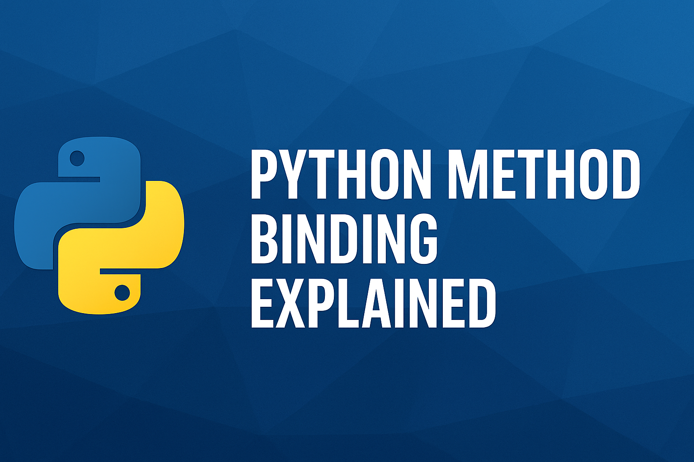
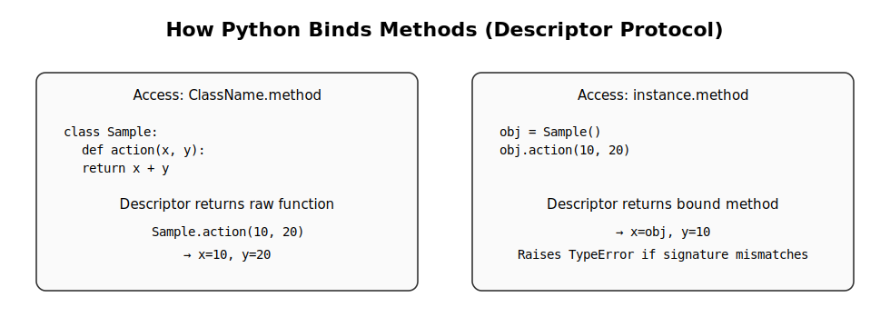
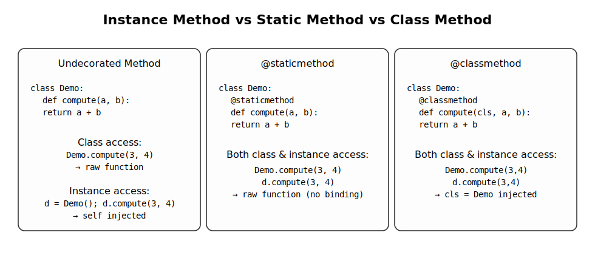

  

# Python Method Binding Explained

**A clear explanation of Python’s method binding rules—how the descriptor protocol governs attribute access, and why calling an undecorated method via the class (e.g., `ClassName.method(arg1, arg2)`) does not involve instance binding.**

Python learners and contributors often encounter confusion around why methods without decorators behave differently depending on how they’re accessed. This project clarifies the mechanism by tracing the actual descriptor protocol (`__get__`) and showing exactly how Python transforms functions into bound or unbound callables.

---

## Table of Contents
- [Full Article: Method Binding Deep Dive](#full-article-method-binding-deep-dive)
- [How Python Binds Methods](#how-python-binds-methods)
- [Instance vs Static vs Class Methods](#instance-vs-static-vs-class-methods)
- [What This Repository Provides](#what-this-repository-provides)

---

## Full Article: Method Binding Deep Dive

For a complete, structured explanation of Python’s method binding rules,  
read the full article here:

**[Full Explanation — method-binding-explained.md](method-binding-explained.md)**

---

## How Python Binds Methods

  

---

## Instance vs Static vs Class Methods

  

---

## What This Repository Provides

- **Accurate, Python-specification–aligned explanations**
- **Step-by-step walkthrough of method lookup & binding**
- **Visual diagrams (SVG) illustrating descriptor behavior**
- **Examples showing class vs instance access differences**
- **Tests validating expected behavior**
- **Beginner-friendly and CPython-style documentation versions**

---
